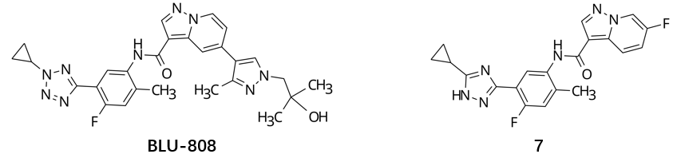

## ligand
Compound | SMILES
-------- | ------
BLU-808| Cc1cc(F)c(-c2nnn(C3CC3)n2)cc1NC(=O)c1cnn2ccc(-c3cn(CC(C)(C)O)nc3C)cc12
cpd 7| Cc1cc(F)c(-c2n[nH]c(C3CC3)n2)cc1NC(=O)c1cnn2cc(F)ccc12

## KIT construct
JMD + Kinase domain (545-952): KIT.FASTA

## MSA
MSA: KIT-JMD_uniref.a3m

## Binding mode prediction

```
# BLU-808
# Bolotz results: boltz_BLU808
boltz predict BLU808_KIT.yaml \
--use_potentials \
--diffusion_samples 10 \
--sampling_steps 1500 \
--step_scale 1.5

# cpd 7
# Boltz results: boltz_cpd7
# PDB code: 12FJ
boltz predict cpd7_KIT.yaml \
--use_potentials \
--diffusion_samples 10 \
--sampling_steps 1500 \
--step_scale 1.5
```
